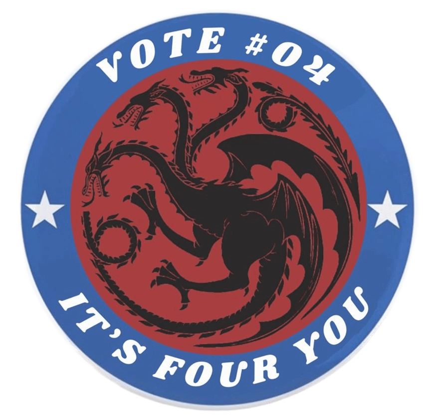

# 🎓 Terna #04 | I.E. San Roberto Belarmino

**Liderando el cambio con propuestas reales y participación activa**

 

---

  

## 🗳️ Nuestro Equipo

| Cargo | Nombre | Rol |
|-------|--------|-----|
| **Representante Estudiantil** | Janfred Espinoza | Voz ante el Consejo Directivo |
| **Personero Estudiantil** | Santiago Díaz | Defensor de derechos estudiantiles |
| **Contralora Estudiantil** | Ana Sofía Montaño | Vigilancia de recursos |

---

## ✨ Nuestros Pilares

### 📢 **Participación Real**
- Asambleas estudiantiles mensuales
- Buzón digital de sugerencias 24/7

### 📚 **Educación de Calidad**
- Clubes de reforzamiento académico
- Talleres de técnicas de estudio

### 🏫 **Bienestar Integral**
- Mejora de áreas comunes
- Campañas de salud mental

---
